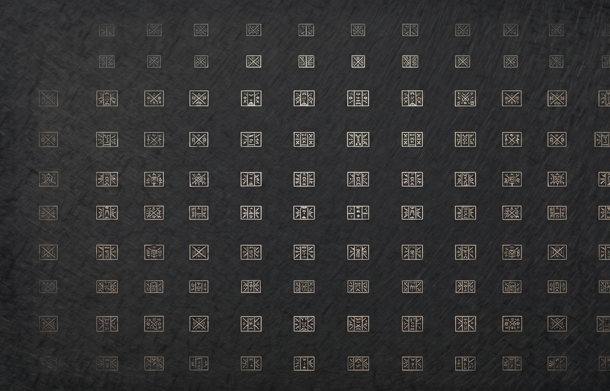

<div align="center">



<br/><br/>


<br/><br/>


</div>

---

### operator card

**Builder** — Justin (Systems & Agent Engineer)  
**Target** — xAI (Frontier Agent Orchestration) | SpaceX (Real-time Telemetry & Systems)  
**Philosophy** — Local metal, zero-dependency cores, offline-first data sovereignty, bionic accessibility.

> *The work lives on the metal. The portal is the lens.*

<br/>

<div align="center">

| Section | Focus |
|:---:|:---|
| **Lens** | [therensisioure.github.io/theRensisioure](https://therensisioure.github.io/theRensisioure/) — **Interactive Portfolio** |
| **System** | Zig engines · real-time audio threads · SQLite encryption |
| **Agents** | Multi-subagent parallel lanes · scope-aware re-rooting trees |
| **Play** | [Snake-Man 0.4.5 — Android debug APK](https://github.com/theRensisioure/theRensisioure.github.io/releases/tag/snake-man-0.4.5) |
| **Contact** | Issues on this repo only |

</div>

<br/>

<div align="center">

```
┌─────────────────────────────────────────────────────────────┐
│  BOOT · SESSION 0x01                                        │
├─────────────────────────────────────────────────────────────┤
│  > whoami                                                   │
│    justin // systems & agent engineer                       │
│  > target --eval                                            │
│    xAI: Colossus agent grids & scope-aware re-rooting       │
│    SpaceX: Zig core systems, win32 multimedia, and DB encryption│
│  > status --horizons                                        │
│    H1: Sesefus (CLI), Sesephus (App), Intuitree (Radial VC) │
│    H2: Advanced Agent Harnessing (Orchestration Container)  │
│    H3: OWNED Remote (Sovereign Streamer), Saturn Nav (GPS)  │
│  > launch --live                                            │
│    visual portfolio: index.html (hosted on GitHub Pages)    │
│  > _                                                        │
└─────────────────────────────────────────────────────────────┘
```

</div>

---

## 🌌 The Development Portfolio — Horizon View

### Horizon 1 — Mature & Shipping (Production Hardened)
- **Sesefus (`ssfs`)**: Zero-dependency Zig CLI engine for offline-first audio capturing, PBKDF2 encryption vaulting, and circadian priority-queue schedules.
- **Sesephus**: App Store personal growth dashboard that bundles and invokes the Sesefus core CLI under the hood.
- **Intuitree**: Adaptive radial branch visualizer for git structures, showcasing click-to-re-root focus navigation and split-view commit/omit gating.

### Horizon 2 — Emerging (Active Scoping)
- **Advanced Agent Harnessing**: Parallel programming subagent runner with context economics, disjoint execution lanes, and automated skill injection hooks.

### Horizon 3 — Concepts (Exploratory Research)
- **OWNED Remote**: Sovereign server architecture for private storage and personal cloud audio streaming.
- **Saturn Nav**: Voice-first motorcyclist GPS featuring hands-free routing and safety-first audio inputs.

---

<div align="center">

*GitHub is the workshop. Readability is the standard.*  
<sub>JetBrains Mono · charcoal canvas · dyslexia-friendly styling</sub>

</div>